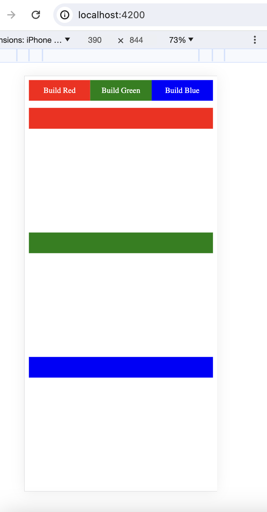
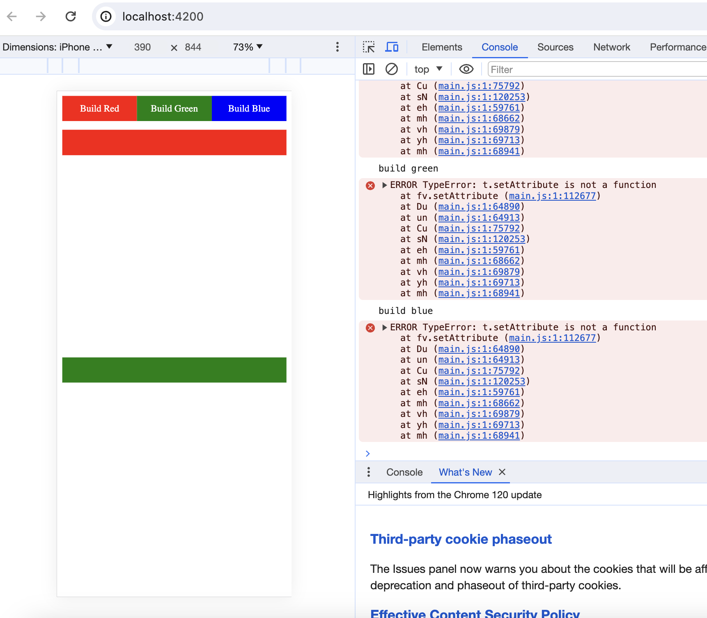
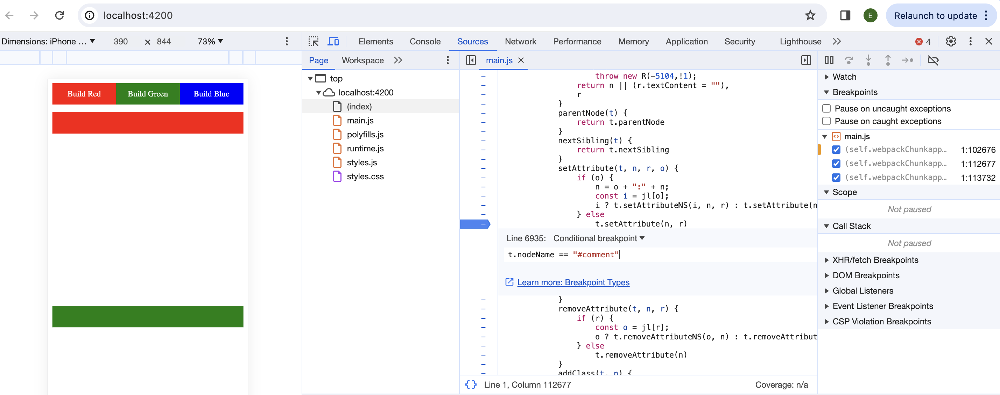
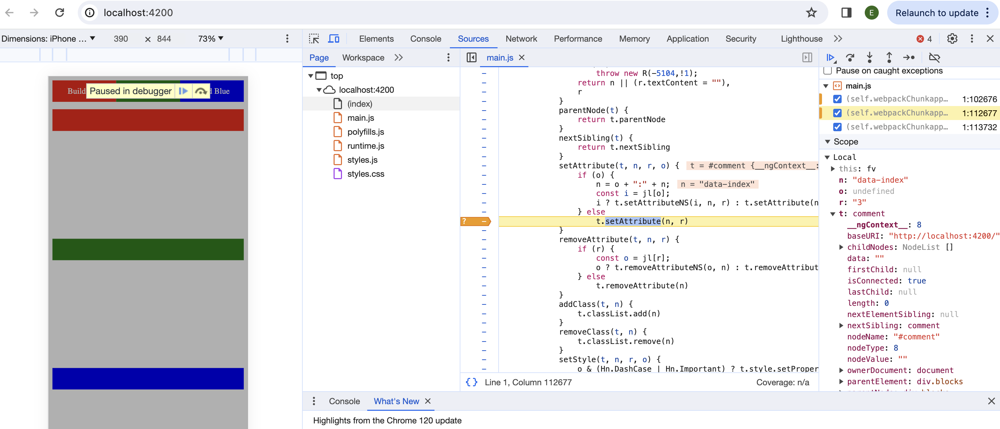

# Applyzer
Application is a basic angular application which is adding containers to a component dynamically.

To replicate bug,
1. Install dependendencies (using force)
`npm i --force`
2. Run application
`npm run start`

When clicking Red, Green and Blue buttons, we get error in console.

